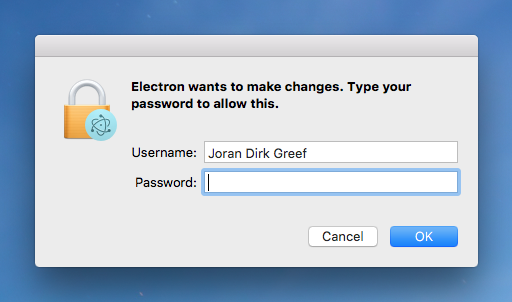

# Sudo

Run a command using sudo, prompting the user with an OS dialog if necessary. Useful for background applications or native Electron apps that need sudo.



Currently supports native OS dialog prompt on Mac OS X (patches welcome for Linux) and uses process.title as the name of the app requesting permission.

Sudo has no external dependencies and does not contain any native bindings.

## Usage
Note: Your command should not start with the "sudo" prefix.
```
// To run a command using sudo:
var sudo = require('sudo-prompt');
sudo.exec('echo hello', function(error) {});

// To update the sudo timestamp for the current user:
sudo.touch(function(error) {});

// To use something other than process.title as the app name:
// Must be alphanumeric (may contain spaces).
sudo.setName('Your app name')
```

## Concurrency
You can call `sudo.exec` and `sudo.touch` concurrently, Sudo will batch up permission requests into a single prompt.
